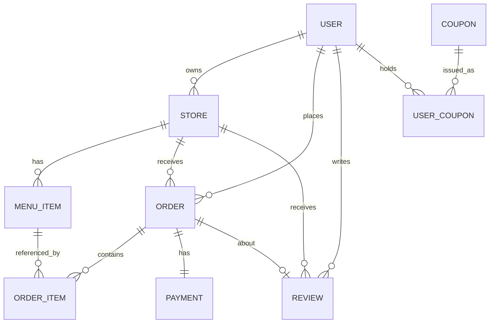

# delivery-app

Spring Boot 기반 미니 배달앱 프로젝트입니다. 레거시 스택(Spring MVC + MyBatis) 환경에서 벗어나 최신 백엔드 기술 스택을 단계적으로 익히기 위한 학습용 사이드 프로젝트입니다.

## 기술 스택 (예정 포함)

- Java 17, Spring Boot 3.x
- Spring Data JPA, Lombok
- MySQL / PostgreSQL
- Spring Security + JWT
- Redis (캐싱, 랭킹)
- RabbitMQ (비동기 알림)
- Elasticsearch (가게/메뉴 검색)
- Docker, GitHub Actions (CI/CD)

## 도메인 모델

### 엔티티 설명

- **User**: 고객/사장님 (role로 구분)
- **Store**: 가게 (owner = User)
- **MenuItem**: 메뉴 (store 참조, stock 재고 컬럼 포함 → 동시성 제어 실습 대상)
- **Order / OrderItem**: 주문 및 주문 상세 (가격은 주문 시점 스냅샷 저장)
- **Payment**: 결제 (mock 처리)
- **Review**: 리뷰 (주문 완료 건에 대해서만 작성 가능)
- **Coupon / UserCoupon**: 선착순 쿠폰 (중복 발급 방지 unique 제약, 동시성 제어 실습 대상)

## 진행 로드맵

- [x] 프로젝트 초기 세팅 (git, .gitignore, README)
- [ ] Spring Boot 프로젝트 생성 + 기본 CRUD (JPA, Lombok)
- [ ] 연관관계 매핑 / N+1 문제 해결
- [ ] 검증 및 전역 예외 처리
- [ ] 테스트 코드 (JUnit5, Testcontainers)
- [ ] Spring Security + JWT 인증
- [ ] Redis 적용 (캐싱, 랭킹)
- [ ] RabbitMQ 적용 (비동기 알림)
- [ ] Elasticsearch 적용 (검색)
- [ ] Docker / Docker Compose
- [ ] CI/CD (GitHub Actions)
